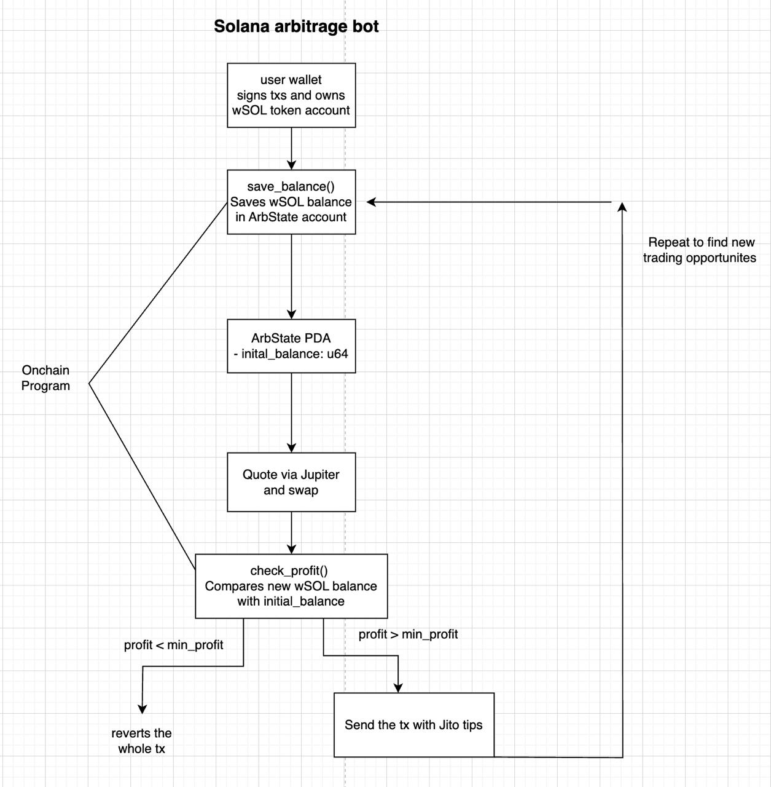

# solana-arb-bot

A Solana arbitrage trading bot that monitors price differences between WSOL and
USDC using Jupiter, and executes profitable round-trip swaps via Jito bundles.



## Features

- Fetches swap quotes from Jupiter for WSOL → USDC → WSOL.
- Calculates potential profit onchain (see [program](https://github.com/jicodes/solana-arb-check)) and tips a portion to Jito.
- Builds and signs versioned transactions using Anchor and Solana web3.
- Sends transactions as bundles to Jito for MEV protection.
- Runs continuously with a configurable loop interval.

## Requirements

- Node.js v18+
- Yarn or npm
- Solana CLI (for keypair generation)
- A funded Solana wallet

## Setup

1. **Clone the repository:**

   ```sh
   git clone https://github.com/yourusername/solana-arb-bot.git
   cd solana-arb-bot
   ```

2. **Install dependencies:**

   ```sh
   npm install
   ```

3. **Configure environment variables:** Create a .env file in the root directory
   with the following content and replace SECRET_KEY with your Solana wallet's
   private key (in base58 format).

   ```
   SECRET_KEY=your_base58_encoded_private_key
   RPC_URL=https://solana-rpc.publicnode.com
   QUOTE_URL=https://api.jup.ag/swap/v1/quote
   SWAP_INSTRUCTION_URL=https://api.jup.ag/swap/v1/swap-instructions/api
   JITO_BUNDLE_URL=https://frankfurt.mainnet.block-engine.jito.wtf/v1/bundles
   ```

4. **Run the bot:**

   ```sh
   npm start
   ```

## Configuration

You can adjust the following constants in `src/index.ts`:

- `PROFIT_THRESHOLD`: Minimum profit (in lamports) to trigger a swap.
- `TIP_RATE`: Percentage of profit to tip Jito.
- `LOOP_INTERVAL_MS`: Delay between each arbitrage attempt (in ms).

## How it Works

1. Fetches a quote for WSOL → USDC and then USDC → WSOL.
2. Calculates the profit after fees and tips.
3. If profit exceeds the threshold, builds a transaction bundle:

- Sets compute budget.
- Executes setup and swap instructions.
- Calls your custom on-chain program for balance/profit checks.
- Transfers tip to Jito.

4. Signs and sends the bundle to Jito's block engine.

## Notes

- Ensure your wallet has enough SOL for fees and swaps.
- Use at your own risk. This bot interacts with mainnet and may incur losses if not configured properly.
- For development, test on Solana devnet and with small amounts.

## License

MIT
